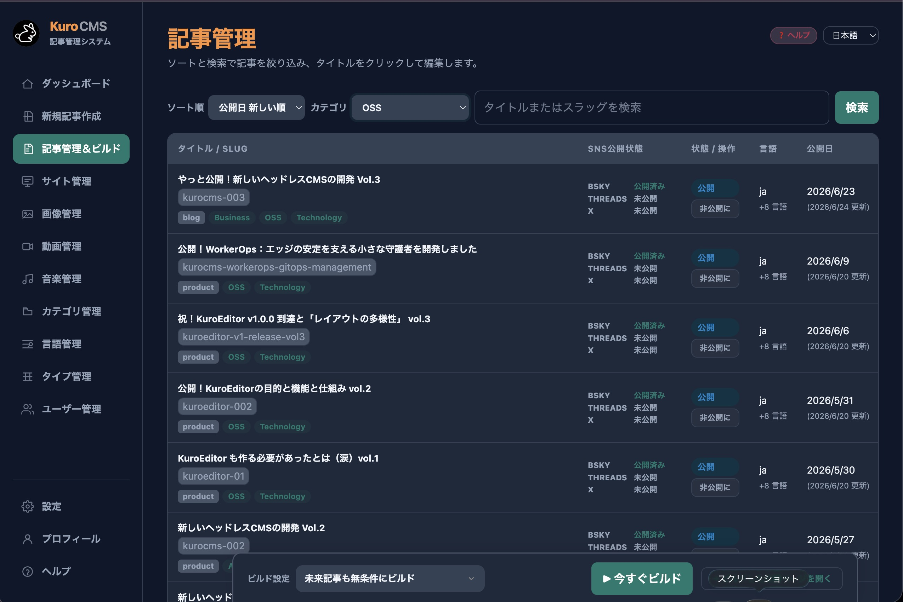

# 🐰 KuroCMS

**The Cloudflare-native, ultra-fast headless CMS — run a multilingual blog for ¥0.**

[**🚀 Install**](https://kuro.boo/kurocms) ・ [**📖 Read the story (EN)**](https://kuro.boo/blog/kurocms-003/?lang=en) ・ [**🏷️ Releases**](https://github.com/Kuro-Boo/KuroCMS/releases) ・ [**🔒 Security**](./SECURITY.md)

> KuroCMS admin · article management — multilingual, per‑article SNS publish state, and one‑click build.

KuroCMS is a lightweight headless CMS that runs **entirely on the Cloudflare global
network** (Workers + D1 + KV + R2). It pairs a polished admin with high‑performance
edge delivery — and is designed so a typical blog runs comfortably **within
Cloudflare's free tier**.

## ✨ Why KuroCMS

- 🚀 **Cloudflare‑native & fast** — Workers + D1 + KV + R2, edge‑cached static delivery.
- 💸 **Runs for ¥0** — built around Cloudflare's free tier: no rental server, no DB ops.
- 🧩 **PC‑free web installer** — provisions D1 / KV / R2 / Worker into *your* Cloudflare account straight from the browser. No CLI, no build.
- 🌐 **Multilingual by design** — one shared article identity, per‑language static output, AI‑friendly translation API.
- ✍️ **Rich WYSIWYG editor (KuroEditor)** — callouts, round boxes, tables, media — with **passkey (WebAuthn)** sign‑in and multi‑device recovery.
- 🎨 **Community templates** — pick a shareable template and make it yours.
- 🤖 **AI‑ready REST API** — clean JSON endpoints for automation and translation.
- 🔑 **Zero runtime dependencies** — vanilla TypeScript on the Workers runtime.

## 🚀 Get started

KuroCMS installs into **your own** Cloudflare account from the browser — no PC setup, no CLI, no build:

### → [Open the web installer at kuro.boo/kurocms](https://kuro.boo/kurocms)

Want the backstory and a feature tour? Read
**[“Finally Released! Development of a New Headless CMS Vol. 3” (English)](https://kuro.boo/blog/kurocms-003/?lang=en)**.

## 🛠️ Tech stack

- **Runtime**: [Cloudflare Workers](https://workers.cloudflare.com/)
- **Database**: [Cloudflare D1](https://developers.cloudflare.com/d1/)
- **Storage**: Cloudflare KV (rendered pages) + R2 (media)
- **Language**: TypeScript — **no framework, zero runtime dependencies**

## 📦 About this repository

This repository publishes the **core source code of KuroCMS for transparency** — so
anyone (especially the security‑minded) can review what the software actually does.
**You don't build or deploy from here** — installation is the one‑click web installer
above.

| Path | Contents |
|---|---|
| `src/` | Cloudflare Worker source (the CMS itself) |
| `migrations/` | D1 database schema migrations |

Release history — versions, change notes, and the built `worker.js` — lives on the
[Releases](https://github.com/Kuro-Boo/KuroCMS/releases) page. Build tooling,
configuration, and maintainer scripts are intentionally omitted (source‑review mirror,
not a build target).

## 🔒 Security

Found a vulnerability? Please see [SECURITY.md](./SECURITY.md) for private reporting
instructions. Do not file public issues for security problems.

## ⚖️ License

KuroCMS is licensed under the **Kuro License** (an MIT‑based license with an
attribution requirement).

> When the Software is used to provide a public‑facing interface, the phrase
> **“with KuroCMS”** must be shown in an appropriate attribution area.

See [LICENSE.txt](./LICENSE.txt) for the full text.
